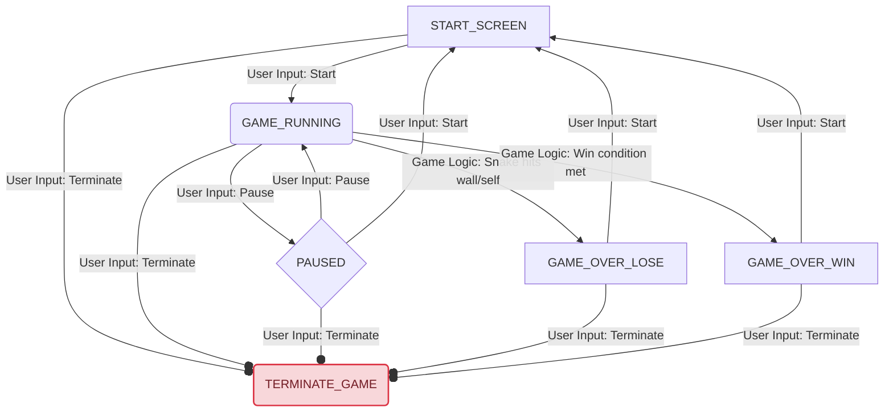

# BrickGame v2.0

A C++/C implementation of classic games (Snake and Tetris) with both console and Qt desktop GUIs.  
Includes unit tests (Google Test) and code coverage support.

---

## Requirements

- **C++20** and **C11** compatible compilers (`g++`, `gcc`)
- **GNU Make**
- **ncurses** (for console GUI)
- **Qt5/Qt6** (for desktop GUI)
- **Google Test** (`libgtest-dev`)
- **CMake** (for building Google Test, if needed)
- **gcovr** (for coverage reports)
- **doxygen** (for documentation, optional)
- **clang-format** (for code formatting, optional)
- **cppcheck** (for static analysis, optional)
- **valgrind** (for memory checks, optional)

### Ubuntu/Debian Quick Install

```sh
sudo apt-get update
sudo apt-get install build-essential g++ gcc cmake libgtest-dev libncursesw5-dev qtbase5-dev qtbase5-dev-tools gcovr doxygen clang-format cppcheck valgrind
# Build Google Test static libs (required for Ubuntu):
cd /usr/src/gtest
sudo cmake .
sudo make
sudo cp *.a /usr/lib
```

---

## How to Build

From the `src/` directory:

```sh
make all
```

This builds:
- Console and desktop versions of Snake and Tetris

---

## How to Run

### Console Games

```sh
make run_snake_cli
make run_tetris_cli
```

### Desktop GUI Games

```sh
make run_snake_gui
make run_tetris_gui
```

---

## How to Test

```sh
make test
```
- Builds and runs all unit tests.
- Generates a coverage report at `tests/coverage.html`.

To open the coverage report:
```sh
xdg-open tests/coverage.html
```

---

## How to Generate Documentation

```sh
make dvi
```
- Generates Doxygen documentation in `docs/html/`.

To open the documentation:
```sh
make open_html
```

---

## How to Check Code Style

```sh
make format   # Dry-run (shows changes)
make formati  # Applies clang-format in-place
```

---

## How to Run Static Analysis

```sh
make cppcheck
```

---

## How to Run Memory Checks

```sh
make valgrind
```
- Runs Valgrind on the test executable.

---

## How to Create a Distribution Package

```sh
make dist
```
- Creates a tarball in `dist/brickgame_dist.tar.gz`.

---

## How to Install/Uninstall Binaries

```sh
sudo make install
sudo make uninstall
```

---

## Main Makefile Targets

| Target             | Description                                      |
|--------------------|--------------------------------------------------|
| `all`              | Build all console and GUI games                  |
| `snake_gui`        | Build Snake desktop GUI                          |
| `tetris_gui`       | Build Tetris desktop GUI                         |
| `snake_cli`        | Build Snake console version                      |
| `tetris_cli`       | Build Tetris console version                     |
| `run_snake_cli`    | Run Snake console game                           |
| `run_tetris_cli`   | Run Tetris console game                          |
| `run_snake_gui`    | Run Snake desktop GUI                            |
| `run_tetris_gui`   | Run Tetris desktop GUI                           |
| `test`             | Build and run unit tests, generate coverage      |
| `coverage`         | Generate coverage report (after running tests)   |
| `dvi`              | Generate Doxygen documentation                   |
| `open_html`        | Open Doxygen HTML documentation                  |
| `format`           | Check code formatting (dry-run)                  |
| `formati`          | Apply code formatting                            |
| `cppcheck`         | Run static analysis                              |
| `valgrind`         | Run memory checks on test executable             |
| `dist`             | Create a distribution tarball                    |
| `install`          | Install binaries to `/usr/local/bin`             |
| `uninstall`        | Remove installed binaries                        |
| `clean`            | Remove all build artifacts                       |

---

## Notes

- All build and test commands should be run from the `src/` directory.
- If you add new tests, place them in `src/tests/` and update the Makefile if needed.

---

## Game State Machine Diagram

Here is a diagram illustrating the states and transitions of the game's Finite State Machine (FSM).


